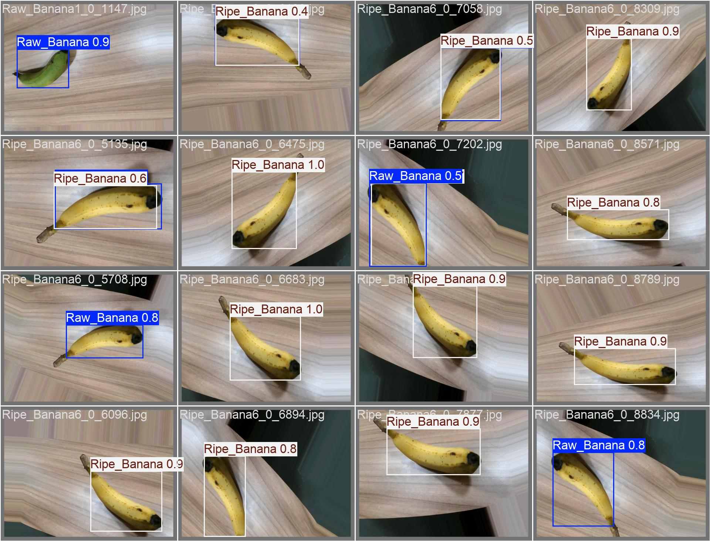

# ripenessAI

An AI-powered computer vision system designed to assess fruit ripeness and support better purchasing decisions in real-world market scenarios.

## Overview

`ripenessAI` combines object detection and ripeness classification to identify fruit and determine whether it is raw or ripe. The project is built with YOLO for object detection and includes dataset preparation, evaluation, and example inference scripts.

## Key Features

- Detects fruit in images and classifies ripeness
- Supports 4 classes: `Raw_Banana`, `Raw_Mango`, `Ripe_Banana`, `Ripe_Mango`
- Includes dataset organization and train/validation splitting utilities
- Provides test evaluation metrics for model quality
- Easy inference through a dedicated YOLO classification script

## Performance Metrics

The current YOLO test evaluation shows strong detection and classification performance:



- Precision: `0.9496`
- Recall: `0.9870`
- mAP50: `0.9930`
- mAP50-95: `0.8678`

These values were generated from the `yolo/test/test_metrics.json` output.

## Repository Structure

- `cnn/`
  - `ripeness_classification.py` - CNN-based classification script for ripeness modeling.
- `data/`
  - Contains the labeled `train/` and `test/` datasets with `images/` and `labels/`.
- `notebooks/`
  - Jupyter notebooks for dataset preparation, training, and model evaluation.
  - Includes saved model files like `ripeness_classification.keras` and `ripeness_classification.h5`.
- `yolo/`
  - `config.yaml` - YOLO dataset configuration file.
  - `train_data_split.py` - Move images from training into validation split.
  - `yolo_classification.py` - Run inference using the YOLO model.
  - `test/` - Contains test scripts and metric outputs.
  - `runs/` - Training and detection run outputs from YOLO.

## Classes

The YOLO model is configured for the following fruit/ripeness categories:

- `Raw_Banana`
- `Raw_Mango`
- `Ripe_Banana`
- `Ripe_Mango`

## Getting Started

### Requirements

- Python 3.8+
- `ultralytics` for YOLO inference
- `numpy`, `opencv-python`, and other standard ML libraries depending on notebook usage

### Install Dependencies

```bash
pip install ultralytics
```

If you use the `cnn/` or notebook workflows, install any additional packages listed in the notebooks or required for TensorFlow/Keras.

### Run YOLO Inference

Use the classification script in `yolo/yolo_classification.py` to detect fruit and print predictions.

```bash
python yolo/yolo_classification.py
```

Update `model_path` and `image_path` inside the script to test your own images.

### Create a Validation Split

The dataset splitting utility moves a random portion of training images to validation.

```bash
python yolo/train_data_split.py
```

## Notes

- The YOLO dataset configuration file is `yolo/config.yaml`.
- Test metrics are saved in `yolo/test/test_metrics.json` and `yolo/test/test_metrics.txt`.
- Detecting ripeness is useful for market buyers, vendors, and retail analytics.

## Contact

For questions or contributions, review the scripts and notebooks in the repository, or use this README as a starting point for extending `ripenessAI` to additional fruits and ripeness stages.
